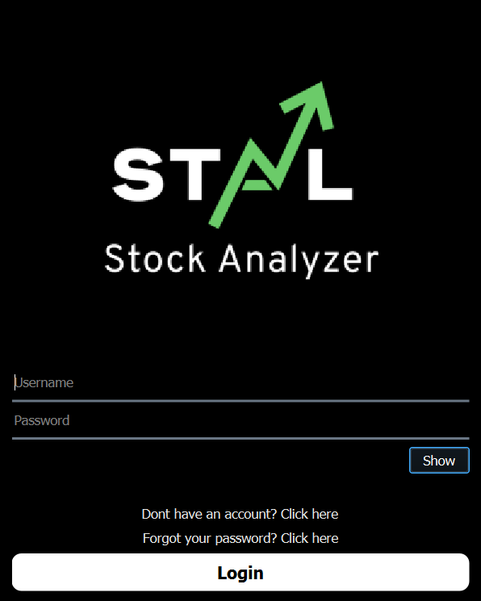
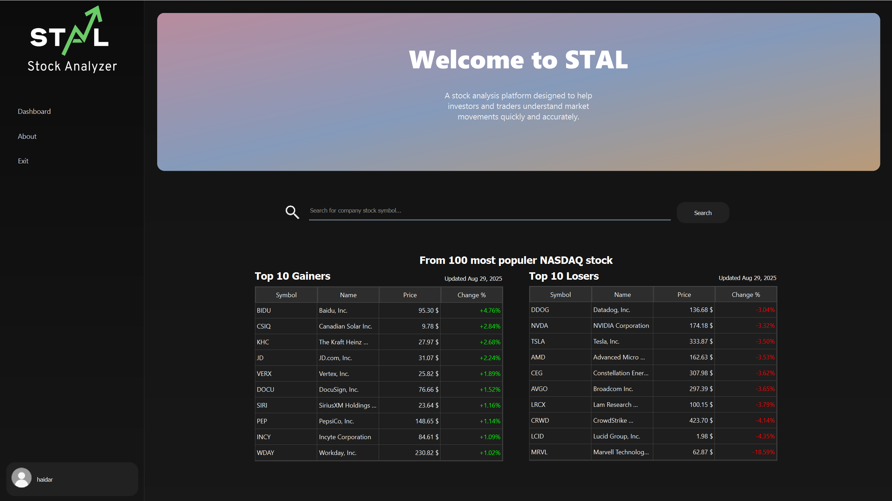

# Project GUI - STAL 

## Tentang Project  
Project ini merupakan aplikasi berbasis **Python** dan didesain menggunakan **Qt Designer**.  
Aplikasi untuk membantu trader menganalisis pergerakan saham ataupun keuangan perusahaan. Fiturnya berupa visualisasi chart price, keuangan perusahaan ataupun prediksi keuangan perusahaan dengan metode numerik

Dengan adanya aplikasi ini, diharapkan pengguna dapat lebih mudah menganalisis kondisi saham sebuah perusahaan.

---

## Tentang Kelompok 5  
Project ini dikembangkan oleh **Kelompok 5** yang beranggotakan:
- Muhammad Haidar Al Ghifari - reset password feature, all of firebase feature, all of main menu feature(search bar, trending, etc)
- Rania Maryam Muthmainnah - login page, main menu page, create account page
- Fathih Rayyandra Firmansyah - All of window stock insight UI and data(matplot, numpy and worthmeter),  all of stock algorithm
- Gregorius Petrus Leslie
---
## Cara Menjalankan  
1. Pastikan Python sudah terpasang di komputer.  
2. Jalankan file `STAL.bat` atau `run.bat`. File ini akan:  
   - Membuat virtual environment (`.venv`) jika belum ada.  
   - Menginstal semua dependencies dari `requirements.txt`.  
   - Menjalankan aplikasi.  
3. Aplikasi akan terbuka dengan tampilan GUI.  

---
## Screenshot Aplikasi  

### Login Page  
  

### Main Menu  
  

---
